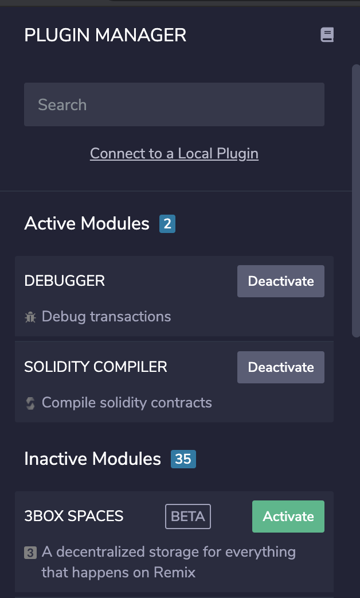
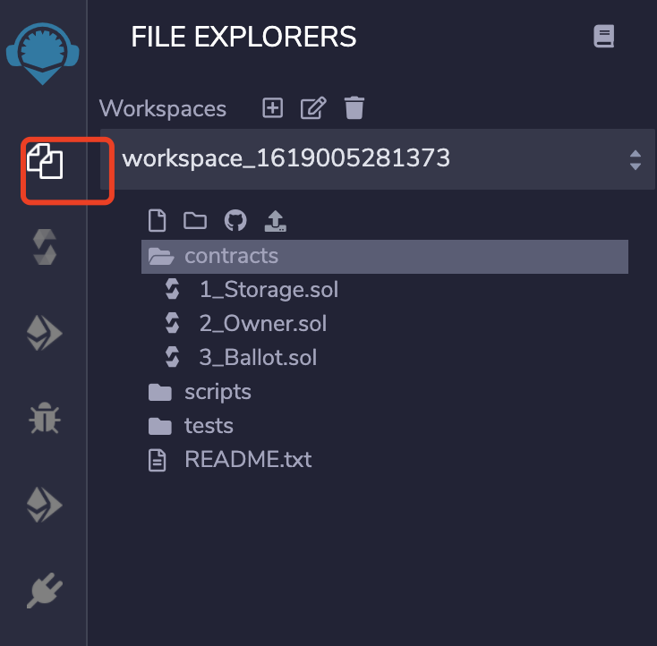
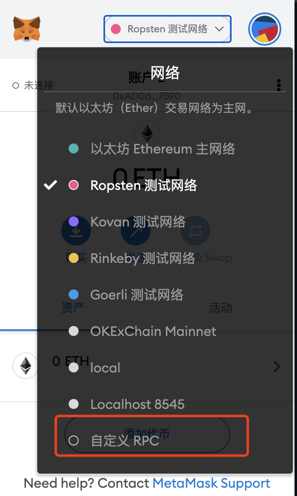

# ontology开发文档

## 网络配置

| Ontology MainNet |      |
| ---------------- | ---- |
| NetworkName      |      |
| chainId          |      |
| Gas Token        | ONG  |
| RPC              |      |
| Websocket        |      |
| Block Explorer   |      |

## 合约部署

本体目前支持neovm，wasm和evm虚拟机（其中neovm和wasm虚拟机部署教程请参考[本体开发文档]([https://dev-docs.ont.io/#/docs-cn/introduction/tools])），本文将着重讲解如果使用以太坊Remix，Truffle等相关工具在Ontology上开发和部署智能合约。

### [Remix IDE](https://remix.ethereum.org/).

1. Remix环境初始化

   如果你首次使用remix那么你应该在remix添加两个模块：Solidity Compiler 和 Deploy and Run Transactions。

   在PLUGIN MANAGER里面寻找Solidity Compiler 和 Deploy and Run Transactions并添加到自己的编译器中。

   

   选择solidity环境，创建HelloWorld.sol合约，将HelloWorld.sol合约复制到该文件中。

   

   ```js
   // Specifies that the source code is for a version
   // of Solidity greater than 0.5.10
   pragma solidity ^0.5.10;
   
   // A contract is a collection of functions and data (its state)
   // that resides at a specific address on the Ethereum blockchain.
   contract HelloWorld {
   
       // The keyword "public" makes variables accessible from outside a contract
       // and creates a function that other contracts or SDKs can call to access the value
       string public message;
   
       // A special function only run during the creation of the contract
       constructor(string memory initMessage) public {
           // Takes a string value and stores the value in the memory data storage area,
           // setting `message` to that value
           message = initMessage;
       }
   
       // A publicly accessible function that takes a string as a parameter
       // and updates `message`
       function update(string memory newMessage) public {
           message = newMessage;
       }
   }
   ```

2. 编译智能合约

   - 点击Solidity Compiler按钮，选择编译器版本为0.5.10，编译HelloWorld.sol。
   - 现在我们可以将合约部署到Ontology网络中，在部署合约之前，我们需要将metamask连接到本体网络。
   - 选择自定义RPC网络，输入网络名字“Ontology TestNet”，在URL输入本体的RPC地址“”，Chain ID选择“”，最后保存我们输入的配置。
   - 去本体Faucet地址领取ONG。
   - 现在我们可以将HelloWorld合约部署到Ontology网络上。
   - 在Environment中选择Injected Web3选项，点击deploy完成合约部署。
   - 

### Truffle

开发环境初始化，首先安装truffle环境允许需要的依赖。

- [Node.js v8+ LTS and npm](https://nodejs.org/en/) (comes with Node)
- [Git](https://git-scm.com/)

使用如下命令安装truffle

```js
npm install -g truffle
```

完成truffle-config的配置，选择truffle-config.js更新该文件。

```js
const HDWalletProvider = require('@truffle/hdwallet-provider');
const fs = require('fs');
const mnemonic = fs.readFileSync(".secret").toString().trim();

module.exports = {
  networks: {
    development: {
      host: "127.0.0.1",     // Localhost (default: none)
      port: 8545,            // Standard Ethereum port (default: none)
      network_id: "*",       // Any network (default: none)
    },
    ontology: {
      provider: () => new HDWalletProvider(mnemonic, `todo`),
      network_id: 80001,
      confirmations: 2,
      timeoutBlocks: 200,
      skipDryRun: true
    },
  },

  // Set default mocha options here, use special reporters etc.
  mocha: {
    // timeout: 100000
  },

  // Configure your compilers
  compilers: {
    solc: {
    }
  }
}
```

你需要在项目的根目录创建.secret文件，将你部署合约使用账户的助记词复制到该文件（账户的助记词可以在metamask里面找到）。

运行如下命令部署合约

```
$ truffle migrate --network ontology
```

显示如下输出则代表部署成功，在编写测试脚本是注意尽量不要使用以太坊代币的单位（如wei，gwei，ether等）

```
2_deploy_contracts.js
=====================

   Replacing 'MyContract'
   ------------------
   > transaction hash:    0x1c94d095a2f629521344885910e6a01076188fa815a310765679b05abc09a250
   > Blocks: 5            Seconds: 5
   > contract address:    0xbFa33D565Fcb81a9CE8e7a35B61b12B04220A8EB
   > block number:        2371252
   > block timestamp:     1578238698
   > account:             0x9fB29AAc15b9A4B7F17c3385939b007540f4d791
   > balance:             0.409358061899298312
   > gas used:            1896986
   > gas price:           0 gwei
   > value sent:          0 ETH
   > total cost:          0 ETH

   Pausing for 2 confirmations...
   ------------------------------
   > confirmation number: 5 (block: 2371262)
initialised!

   > Saving migration to chain.
   > Saving artifacts
   -------------------------------------
   > Total cost:                   0 ETH


Summary
=======
> Total deployments:   2
> Final cost:          0 ETH
```

## 开发工具

## 钱包使用

### Metamask

Metamask是一个用户用于使用自己设定密码管理以太坊钱包私钥的插件，它是一个非托管的钱包，这意味着用户有权限自己管理自己的私钥，一旦丢失该私钥用户将无法恢复对钱包的使用。

**Type**: Non-custodial/HD
**Private Key Storage**: User’s local browser storage
**Communication to Ethereum Ledger**: Infura
**Private key encoding**: Mnemonic

1. 初始化 Web3

   Step 1:

   在你的DApp内安装web3环境:

   ```
   npm install --save web3
   ```

   生成一个新的文件，命名为 `web3.js` ，将以下代码复制到该文件:

   ```js
   import Web3 from 'web3';
   
   const getWeb3 = () => new Promise((resolve) => {
     window.addEventListener('load', () => {
       let currentWeb3;
   
       if (window.ethereum) {
         currentWeb3 = new Web3(window.ethereum);
         try {
           // Request account access if needed
           window.ethereum.enable();
           // Acccounts now exposed
           resolve(currentWeb3);
         } catch (error) {
           // User denied account access...
           alert('Please allow access for the app to work');
         }
       } else if (window.web3) {
         window.web3 = new Web3(web3.currentProvider);
         // Acccounts always exposed
         resolve(currentWeb3);
       } else {
         console.log('Non-Ethereum browser detected. You should consider trying MetaMask!');
       }
     });
   });
   
   
   export default getWeb3;
   ```

   简言之，只要你在你的Chrome浏览器里安装了Metamask插件，你就可以使用该插件注入的`ethereum`全局变量。

   Step 2:

   在你的client里引入如下代码,

   ```js
   import getWeb3 from '/path/to/web3';
   ```

   调用如下函数:

   ```js
     getWeb3()
       .then((result) => {
         this.web3 = result;// we instantiate our contract next
       });
   ```

2. 获取账户

   我们需要从以上创建的web3实例中获取一个账户来发送交易。

   ```js
     this.web3.eth.getAccounts()
     .then((accounts) => {
       this.account = accounts[0];
     })
   ```

   `getAccounts()` 函数 返回了metamask中的账户, `accounts[0]` 是当前用户的.

3. 初始化你的合约

4. 调用函数

   现在你可以使用你刚才创建的合约实例调用任何你想调用的函数

   注: - 你可以使用 `send()` 函数调用合约来改变合约状态

   ​	 - 调用 `call()` 函数完成合约的预执行操作

**Calling `call()` Functions**

```js
  this.myContractInstance.methods.myMethod(myParams)
  .call()
  .then (
    // do stuff with returned values
  )
```

**Calling `send()` Functions**

```js
  this.myContractInstance.methods.myMethod(myParams)
  .send({
    from: this.account,gasPrice: 0
  })
  .then (
    (receipt) => {
      // returns a transaction receipt}
    )
```

### Onto Web Wallet

TODO

## API 参考

由于以太坊与本体交易的结构体和存储结构存在差异，目前本体只支持了以太坊部分RPC接口（ontology部分接口返回的内容与以太坊返回的有所不同），具体如下：

### net_version

返回当前连接网络的ID。

#### 参数

无

#### 返回值

`String` - 当前连接网络的ID

- "1": Ontology Mainnet

#### 示例代码

请求：

```js
curl -X POST --data '{"jsonrpc":"2.0","method":"net_version","params":[],"id":67}'
```

响应：

```js
{
  "id":67,
  "jsonrpc": "2.0",
  "result": "1"
}
```

### eth_chainId

返回当前链的chainId。

#### 参数

无

#### 返回值

`String` - 当前连接网络的ID

- "***": Ontology Mainnet ChainId   TODO

#### 示例代码

请求：

```js
curl -X POST --data '{"jsonrpc":"2.0","method":"eth_chainId","params":[],"id":83}'
```

响应：

```js
{
  "id": 83,
  "jsonrpc": "2.0",
  "result": "0x00" // TODO
}
```

### eth_blockNumber

返回最新块的编号。

#### 参数

无

#### 返回值

`QUANTITY` - 节点当前块编号

#### 示例代码

请求：

```
curl -X POST --data '{"jsonrpc":"2.0","method":"eth_blockNumber","params":[],"id":83}'
```

响应：

```
{
  "id":83,
  "jsonrpc": "2.0",
  "result": "0x4b7" // 1207
}
```

### eth_getBalance

返回指定地址账户的余额。

#### 参数

- `DATA` - 20字节，要检查余额的地址
- `QUANTITY|TAG` - 整数块编号，或者字符串"latest", "earliest" 或 "pending"

```
params: [
   '0x407d73d8a49eeb85d32cf465507dd71d507100c1',
   'latest'
]
```

#### 返回值

`QUANTITY` - 当前余额，单位：wei

#### 示例代码

请求：

```
curl -X POST --data '{"jsonrpc":"2.0","method":"eth_getBalance","params":["0x407d73d8a49eeb85d32cf465507dd71d507100c1", "latest"],"id":1}'
```

响应：

```
{
  "id":1,
  "jsonrpc": "2.0",
  "result": "0x0234c8a3397aab58" // 158972490234375000
}
```

# eth_getBalance

返回指定地址账户当前高度ONG的余额。

### 参数

- `DATA` - 20字节，要检查余额的地址
- `QUANTITY|TAG` - 整数块编号，或者字符串"latest", "earliest" 或 "pending"（该参数不起作用）

```
params: [
   '0x407d73d8a49eeb85d32cf465507dd71d507100c1',
   'latest'
]
```

### 返回值

`QUANTITY` - 当前余额，单位：wei

### 示例代码

请求：

```
curl -X POST --data '{"jsonrpc":"2.0","method":"eth_getBalance","params":["0x407d73d8a49eeb85d32cf465507dd71d507100c1", "latest"],"id":1}'
```

响应：

```
{
  "id":1,
  "jsonrpc": "2.0",
  "result": "0x0234c8a3397aab58" // 158972490234375000
}
```

### eth_protocolVersion

返回当前以太坊协议的版本。

#### 参数

无

#### 返回值

`String` - 当前的以太坊协议版本

#### 示例代码

请求：

```
curl -X POST --data '{"jsonrpc":"2.0","method":"eth_protocolVersion","params":[],"id":67}'
```

响应：

```
{
  "id":67,
  "jsonrpc": "2.0",
  "result": "65"
}
```

### eth_syncing

对于已经同步的客户端，该调用返回一个描述同步状态的对象。

#### 参数

无

#### 返回值

`Object|Boolean`, 同步状态对象或false。同步对象的结构如下：

- startingBlock: QUANTITY - 开始块
- currentBlock: QUANTITY - 当前块，同eth_blockNumber
- highestBlock: QUANTITY - 预估最高块

#### 示例代码

请求：

```
curl -X POST --data '{"jsonrpc":"2.0","method":"eth_syncing","params":[],"id":1}'
```

响应：

```
{
  "id":1,
  "jsonrpc": "2.0",
  "result": {
    startingBlock: '0',
    currentBlock: '0x386',
    highestBlock: '0x454'
  }
}
```

### eth_gasPrice

返回当前的gas价格，单位：wei。

#### 参数

无

#### 返回值

`QUANTITY` - 整数，以wei为单位的当前gas价格

#### 示例代码

请求：

```
curl -X POST --data '{"jsonrpc":"2.0","method":"eth_gasPrice","params":[],"id":73}'
```

响应：

```
{
  "id":73,
  "jsonrpc": "2.0",
  "result": "0x09184e72a000" // 10000000000000
}
```

### eth_getStorageAt

返回指定地址存储位置的值。

#### 参数

- `DATA` - 20字节，存储地址
- `QUANTITY` - 存储中的位置号
- `QUANTITY|TAG` - 整数块号，或字符串"latest"、"earliest" 或"pending"（该参数为无效参数）

#### 返回值

`DATA` - 指定存储位置的值

#### 示例代码

根据要提取的存储计算正确的位置。考虑下面的合约，由`0x391694e7e0b0cce554cb130d723a9d27458f9298` 部署在地址`0x295a70b2de5e3953354a6a8344e616ed314d7251`：

```
contract Storage {
    uint pos0;
    mapping(address => uint) pos1;

    function Storage() {
        pos0 = 1234;
        pos1[msg.sender] = 5678;
    }
}
```

提取pos0的值很直接：

```
curl -X POST --data '{"jsonrpc":"2.0", "method": "eth_getStorageAt", "params": ["0x295a70b2de5e3953354a6a8344e616ed314d7251", "0x0", "latest"], "id": 1}' localhost:8545
```

响应结果：

```
{"jsonrpc":"2.0","id":1,"result":"0x00000000000000000000000000000000000000000000000000000000000004d2"}
```

要提取映射表中的成员就难一些了。映射表中成员位置的计算如下：

```
keccack(LeftPad32(key, 0), LeftPad32(map position, 0))
```

这意味着为了提取`pos1["0x391694e7e0b0cce554cb130d723a9d27458f9298"]`的值，我们需要如下计算：

```
keccak(decodeHex("000000000000000000000000391694e7e0b0cce554cb130d723a9d27458f9298" + "0000000000000000000000000000000000000000000000000000000000000001"))
```

geth控制台自带的web3库可以用来进行这个计算：

```
> var key = "000000000000000000000000391694e7e0b0cce554cb130d723a9d27458f9298" + "0000000000000000000000000000000000000000000000000000000000000001"
undefined
> web3.sha3(key, {"encoding": "hex"})
"0x6661e9d6d8b923d5bbaab1b96e1dd51ff6ea2a93520fdc9eb75d059238b8c5e9"
```

现在可以提取指定位置的值了：

```
curl -X POST --data '{"jsonrpc":"2.0", "method": "eth_getStorageAt", "params": ["0x295a70b2de5e3953354a6a8344e616ed314d7251", "0x6661e9d6d8b923d5bbaab1b96e1dd51ff6ea2a93520fdc9eb75d059238b8c5e9", "latest"], "id": 1}' localhost:8545
```

相应结果如下：

```
{"jsonrpc":"2.0","id":1,"result":"0x000000000000000000000000000000000000000000000000000000000000162e"}
```

### eth_getTransactionCount

返回指定地址发生的使用EVM虚拟机交易数量。

#### 参数

- `DATA` - 20字节，地址
- `QUANTITY|TAG` - 整数块编号，或字符串"latest"、"earliest"或"pending"

```
params: [
   '0x407d73d8a49eeb85d32cf465507dd71d507100c1',
   'latest' // state at the latest block
]
```

#### 返回值

`QUANTITY` - 从指定地址发出的交易数量，整数

#### 示例代码

请求：

```
curl -X POST --data '{"jsonrpc":"2.0","method":"eth_getTransactionCount","params":["0x407d73d8a49eeb85d32cf465507dd71d507100c1","latest"],"id":1}'
```

响应：

```
{
  "id":1,
  "jsonrpc": "2.0",
  "result": "0x1" // 1
}
```

### eth_getBlockTransactionCountByHash

返回指定块内的使用EVM虚拟机交易数量，使用哈希来指定块。

#### 参数

`DATA` - 32字节，块哈希

```
params: [
   '0xb903239f8543d04b5dc1ba6579132b143087c68db1b2168786408fcbce568238'
]
```

#### 返回值

`QUANTITY` - 指定块内的交易数量，整数

#### 示例代码

请求：

```
curl -X POST --data '{"jsonrpc":"2.0","method":"eth_getBlockTransactionCountByHash","params":["0xb903239f8543d04b5dc1ba6579132b143087c68db1b2168786408fcbce568238"],"id":1}'
```

响应：

```
{
  "id":1,
  "jsonrpc": "2.0",
  "result": "0xb" // 11
}
```

### eth_getBlockTransactionCountByNumber

返回指定块内的交易数量，使用块编号指定块。

#### 参数

`QUANTITY|TAG` - 整数块编号，或字符串"earliest"、"latest"或"pending"

```
params: [
   '0xe8', // 232
]
```

#### 返回值

`QUANTITY` - 指定块内的交易数量

#### 示例代码

请求：

```
curl -X POST --data '{"jsonrpc":"2.0","method":"eth_getBlockTransactionCountByNumber","params":["0xe8"],"id":1}'
```

响应：

```
{
  "id":1,
  "jsonrpc": "2.0",
  "result": "0xa" // 10
}
```

### eth_getCode

返回指定地址的代码。

#### 参数

- `DATA` - 20字节，地址
- `QUANTITY|TAG` - 整数块编号，或字符串"latest"、"earliest" 或"pending"（无效参数）

```
params: [
   '0xa94f5374fce5edbc8e2a8697c15331677e6ebf0b',
   '0x2'  // 2
]
```

#### 返回值

`DATA` - 指定地址处的代码

#### 示例代码

请求：

```
curl -X POST --data '{"jsonrpc":"2.0","method":"eth_getCode","params":["0xa94f5374fce5edbc8e2a8697c15331677e6ebf0b", "0x2"],"id":1}'
```

响应：

```
{
  "id":1,
  "jsonrpc": "2.0",
  "result": "0x600160008035811a818181146012578301005b601b6001356025565b8060005260206000f25b600060078202905091905056"
}
```

### eth_getTransactionLogs

返回交易执行的日志。

#### 参数

- `txHash` - 交易哈希

```
params: [
   '0x4a9e7c5ec484c1cb854d2831ff51f66f2771e8143362aa75c84f0c6544048fba'
   ]
```

#### 返回值

返回交易执行日志

#### 示例代码

请求：

```
curl -X POST --data '{
     "jsonrpc": "2.0",
     "id": 2233,
     "method": "eth_getTransactionLogs",
     "params": [
       "0x4a9e7c5ec484c1cb854d2831ff51f66f2771e8143362aa75c84f0c6544048fba"
     ]
   }'
```

响应：

```
{
    "jsonrpc": "2.0",
    "id": 2233,
    "result": [
        {
            "address": "0x9ea0eff7153cebbdd18c2ca3bad818e29e556ba7",
            "topics": [
                "0x7ac369dbd14fa5ea3f473ed67cc9d598964a77501540ba6751eb0b3decf5870d"
            ],
            "data": "0x0000000000000000000000000000000000000000000000000000000000000000000000000000000000000000f4ffabb197396c7f48c9cd47ec462b54ed9ce84c",
            "blockNumber": "0x25b",
            "transactionHash": "0x4a9e7c5ec484c1cb854d2831ff51f66f2771e8143362aa75c84f0c6544048fba",
            "transactionIndex": "0x0",
            "blockHash": "0x77abadf9e4ad688212a70260244987f6623b54b56ea737a2cfbc7e7a6344eddc",
            "logIndex": "0x0",
            "removed": false
        }
    ]
}
```

### eth_sendRawTransaction

为签名交易创建一个新的消息调用交易或合约。

#### 参数

`DATA` - 签名的交易数据

```
params: ["0xd46e8dd67c5d32be8d46e8dd67c5d32be8058bb8eb970870f072445675058bb8eb970870f072445675"]
```

#### 返回值

`DATA` - 32字节，交易哈希，如果交易未生效则返回全0哈希。

当创建合约时，在交易生效后，使用`eth_getTransactionReceipt`获取合约地址。

#### 示例代码

请求：

```
curl -X POST --data '{"jsonrpc":"2.0","method":"eth_sendRawTransaction","params":[{see above}],"id":1}'
```

响应：

```
{
  "id":1,
  "jsonrpc": "2.0",
  "result": "0xe670ec64341771606e55d6b4ca35a1a6b75ee3d5145a99d05921026d1527331"
}
```

### eth_call

立刻执行一个新的消息调用，无需在区块链上创建交易。

#### 参数

`Object` - 交易调用对象

- from: DATA, 20 Bytes - 发送交易的原地址，可选
- to: DATA, 20 Bytes - 交易目标地址
- gas: QUANTITY - 交易可用gas量，可选。eth_call不消耗gas，但是某些执行环节需要这个参数
- gasPrice: QUANTITY - gas价格，可选
- value: QUANTITY - 交易发送的以太数量，可选
- data: DATA - 方法签名和编码参数的哈希，可选
- QUANTITY|TAG - 整数块编号，或字符串"latest"、"earliest"或"pending"

#### 返回值

`DATA` - 所执行合约的返回值

#### 示例代码

请求：

```
curl -X POST --data '{"jsonrpc":"2.0","method":"eth_call","params":[{see above}],"id":1}'
```

响应：

```
{
  "id":1,
  "jsonrpc": "2.0",
  "result": "0x"
}
```

### eth_estimateGas

执行并估算一个交易需要的gas用量。该次交易不会写入区块链。注意，由于多种原因，例如EVM的机制 及节点旳性能，估算的数值可能比实际用量大的多。

#### 参数

参考`eth_call`调用的参数，所有的属性都是可选的。如果没有指定gas用量上限，geth将使用挂起块的gas上限。 在这种情况下，返回的gas估算量可能不足以执行实际的交易。

#### 返回值

`QUANTITY` - gas用量估算值

#### 示例代码

请求：

```
curl -X POST --data '{"jsonrpc":"2.0","method":"eth_estimateGas","params":[{see above}],"id":1}'
```

返回值：

```
{
  "id":1,
  "jsonrpc": "2.0",
  "result": "0x5208" // 21000
}
```

### eth_getBlockByNumber

返回指定编号的块。

#### 参数

- `QUANTITY|TAG` - 整数块编号，或字符串"earliest"、"latest" 或"pending"
- `Boolean` - 为true时返回完整的交易对象，否则仅返回交易哈希

```
params: [
   '0x1b4', // 436
   true
]
```

#### 返回值

`Object` - 匹配的块对象，如果未找到块则返回null，结构如下：

- number: QUANTITY - 块编号
- hash: DATA, 32 Bytes - 块哈希
- parentHash: DATA, 32 Bytes - 父块的哈希
- nonce: DATA, 8 Bytes - 空
- sha3Uncles: DATA, 32 Bytes - 空
- logsBloom: DATA, 256 Bytes - 空
- transactionsRoot: DATA, 32 Bytes - 块中的交易树根节点
- stateRoot: DATA, 32 Bytes - 空
- receiptsRoot: DATA, 32 Bytes - 空
- miner: DATA, 20 Bytes - 空
- difficulty: QUANTITY - 空
- totalDifficulty: QUANTITY - 空
- extraData: DATA - 空
- size: QUANTITY - 本块字节数
- gasLimit: QUANTITY - 本块允许的最大gas用量
- gasUsed: QUANTITY - 本块中所有交易使用的总gas用量
- timestamp: QUANTITY - 块时间戳
- transactions: Array - 交易对象数组，或32字节长的交易哈希数组
- uncles: Array - 空

#### 示例代码

请求：

```
curl -X POST --data '{"jsonrpc":"2.0","method":"eth_getBlockByNumber","params":["0x1b4", true],"id":1}'
```

响应：

```
{
    "jsonrpc": "2.0",
    "id": 2233,
    "result": {
        "difficulty": "0x0",
        "extraData": "0x",
        "gasLimit": "0x0",
        "gasUsed": "0x0",
        "hash": "0x9e539021092397ec631cbb05fa5418e83b5cccb95dd4663180c243425f01d7b2",
        "logsBloom": "0x00000000000000000000000000000000000000000000000000000000000000000000000000000000000000000000000000000000000000000000000000000000000000000000000000000000000000000000000000000000000000000000000000000000000000000000000000000000000000000000000000000000000000000000000000000000000000000000000000000000000000000000000000000000000000000000000000000000000000000000000000000000000000000000000000000000000000000000000000000000000000000000000000000000000000000000000000000000000000000000000000000000000000000000000000000000",
        "miner": "0x0000000000000000000000000000000000000000",
        "mixHash": "0x0000000000000000000000000000000000000000000000000000000000000000",
        "nonce": "0x0000000000000000",
        "number": "0x1b4",
        "parentHash": "0xea06f581bb1e1c4a828f149106e697542bb484627e518ab905a67998d9b670dc",
        "receiptsRoot": "0x0000000000000000000000000000000000000000000000000000000000000000",
        "sha3Uncles": "0x0000000000000000000000000000000000000000000000000000000000000000",
        "size": "0xf2",
        "stateRoot": "0x",
        "timestamp": "0x60c04264",
        "totalDifficulty": "0x0",
        "transactions": [],
        "transactionsRoot": "0x0000000000000000000000000000000000000000000000000000000000000000",
        "uncles": []
    }
}
```

### eth_getBlockByHash

返回具有指定哈希的块。

#### 参数

- `DATA`, 32字节 - 块哈希
- `Boolean` - 为true时返回完整的交易对象，否则仅返回交易哈希

```
params: [
   '0xe670ec64341771606e55d6b4ca35a1a6b75ee3d5145a99d05921026d1527331',
   true
]
```

#### 返回值

参考`eth_getBlockByNumber`的返回值。

### 示例代码

请求：

```
curl -X POST --data '{"jsonrpc":"2.0","method":"eth_getBlockByHash","params":["0xe670ec64341771606e55d6b4ca35a1a6b75ee3d5145a99d05921026d1527331", true],"id":1}'
```

响应：

参考`eth_getBlockByNumber`。

### eth_getTransactionByHash

返回指定哈希对应的交易。

#### 参数

`DATA`, 32 字节 - 交易哈希

```
params: [
   "0xb903239f8543d04b5dc1ba6579132b143087c68db1b2168786408fcbce568238"
]
```

#### 返回值

`Object` - 交易对象，如果没有找到匹配的交易则返回null。结构如下：

- hash: DATA, 32字节 - 交易哈希
- nonce: QUANTITY - 本次交易之前发送方已经生成使用evm虚拟机的交易数量
- blockHash: DATA, 32字节 - 交易所在块的哈希，对于挂起块，该值为null
- blockNumber: QUANTITY - 交易所在块的编号，对于挂起块，该值为null
- transactionIndex: QUANTITY - 交易在块中的索引位置，挂起块该值为null
- from: DATA, 20字节 - 交易发送方地址
- to: DATA, 20字节 - 交易接收方地址，对于合约创建交易，该值为null
- value: QUANTITY - 发送的以太数量，单位：wei
- gasPrice: QUANTITY - 发送方提供的gas价格，单位：wei
- gas: QUANTITY - 发送方提供的gas可用量
- input: DATA - 随交易发送的数据

#### 示例代码

请求：

```
curl -X POST --data '{"jsonrpc":"2.0","method":"eth_getTransactionByHash","params":["0xb903239f8543d04b5dc1ba6579132b143087c68db1b2168786408fcbce568238"],"id":1}'
```

响应：

```
{
"id":1,
"jsonrpc":"2.0",
"result": {
    "hash":"0xc6ef2fc5426d6ad6fd9e2a26abeab0aa2411b7ab17f30a99d3cb96aed1d1055b",
    "nonce":"0x",
    "blockHash": "0xbeab0aa2411b7ab17f30a99d3cb9c6ef2fc5426d6ad6fd9e2a26a6aed1d1055b",
    "blockNumber": "0x15df", // 5599
    "transactionIndex":  "0x1", // 1
    "from":"0x407d73d8a49eeb85d32cf465507dd71d507100c1",
    "to":"0x85h43d8a49eeb85d32cf465507dd71d507100c1",
    "value":"0x7f110", // 520464
    "gas": "0x7f110", // 520464
    "gasPrice":"0x09184e72a000",
    "input":"0x603880600c6000396000f300603880600c6000396000f3603880600c6000396000f360",
  }
}
```

### eth_getTransactionByBlockHashAndIndex

返回指定块内具有指定索引序号的交易。

#### 参数

- `DATA`, 32字节 - 块哈希
- `QUANTITY` - 交易在块内的索引序号

```
params: [
   '0xe670ec64341771606e55d6b4ca35a1a6b75ee3d5145a99d05921026d1527331',
   '0x0' // 0
]
```

#### 返回值

查阅`eth_getTransactionByHash`的返回值

#### 示例代码

请求：

```
curl -X POST --data '{"jsonrpc":"2.0","method":"eth_getTransactionByBlockHashAndIndex","params":["0xc6ef2fc5426d6ad6fd9e2a26abeab0aa2411b7ab17f30a99d3cb96aed1d1055b", "0x0"],"id":1}'
```

返回值请参考`eth_getTransactionByHash`的返回值。

### eth_getTransactionByBlockNumberAndIndex

返回指定编号的块内具有指定索引序号的交易。

#### 参数

- `QUANTITY|TAG` - 整数块编号，或字符串"earliest"、"latest" 或"pending"
- `QUANTITY` - 交易索引序号

```
params: [
   '0x29c', // 668
   '0x0' // 0
]
```

#### 返回值

请参考`eth_getTransactionByHash`的返回值。

#### 示例代码

请求：

```
curl -X POST --data '{"jsonrpc":"2.0","method":"eth_getTransactionByBlockNumberAndIndex","params":["0x29c", "0x0"],"id":1}'
```

响应结果请参考`eth_getTransactionByHash`调用。

### eth_getTransactionReceipt

返回指定交易的收据，使用哈希指定交易。

需要指出的是，挂起的交易其收据无效。

#### 参数

`DATA`, 32字节 - 交易哈希

```
params: [
   '0xb903239f8543d04b5dc1ba6579132b143087c68db1b2168786408fcbce568238'
]
```

#### 返回值

`Object` - 交易收据对象，如果收据不存在则为null。交易对象的结构如下：

- transactionHash: DATA, 32字节 - 交易哈希
- transactionIndex: QUANTITY - 交易在块内的索引序号
- blockHash: DATA, 32字节 - 交易所在块的哈希
- blockNumber: QUANTITY - 交易所在块的编号
- from: DATA, 20字节 - 交易发送方地址
- to: DATA, 20字节 - 交易接收方地址，对于合约创建交易该值为null
- cumulativeGasUsed: QUANTITY - 交易所在块消耗的gas总量
- gasUsed: QUANTITY - 该次交易消耗的gas用量
- contractAddress: DATA, 20字节 - 对于合约创建交易，该值为新创建的合约地址，否则为null
- logs: Array - 本次交易生成的日志对象数组
- logsBloom: DATA, 256字节 - bloom过滤器，空

- status: QUANTITY ，1 (成功) 或 0 (失败)

#### 示例代码

请求：

```
curl -X POST --data '{    "jsonrpc": "2.0",
    "id": 16661,
    "method": "eth_getTransactionReceipt",
    "params": [
        "0xe15e2c2240dc58dff54f7c4561a3f784b4ac91cefd0b7cf4dad014fd8a0ad70b"
    ]'
```

响应：

```
{
    "jsonrpc": "2.0",
    "id": 16661,
    "result": {
        "blockHash": "0x747d2b4599a08c423d50ec772897c992b01b1ac1510d487be52d0167014bd063",
        "blockNumber": "0x204",
        "contractAddress": "0xddcb212ce4896bb02f79db726f6bb8588df41a5c",
        "cumulativeGasUsed": "0x13eecbeb0",
        "from": "0x96216849c49358b10257cb55b28ea603c874b05e",
        "gasUsed": "0x20a86c",
        "logs": [
            {
                "address": "0xddcb212ce4896bb02f79db726f6bb8588df41a5c",
                "topics": [
                    "0x7ac369dbd14fa5ea3f473ed67cc9d598964a77501540ba6751eb0b3decf5870d"
                ],
                "data": "0x000000000000000000000000000000000000000000000000000000000000000000000000000000000000000055354e90851d79ee31d8f27d94613cf8f5e7f9e8",
                "blockNumber": "0x204",
                "transactionHash": "0xe15e2c2240dc58dff54f7c4561a3f784b4ac91cefd0b7cf4dad014fd8a0ad70b",
                "transactionIndex": "0x0",
                "blockHash": "0x747d2b4599a08c423d50ec772897c992b01b1ac1510d487be52d0167014bd063",
                "logIndex": "0x0",
                "removed": false
            },
            {
                "address": "0xddcb212ce4896bb02f79db726f6bb8588df41a5c",
                "topics": [
                    "0xedffc32e068c7c95dfd4bdfd5c4d939a084d6b11c4199eac8436ed234d72f926"
                ],
                "data": "0x0000000000000000000000000000000000000000000000000000000000000000000000000000000000000000a5b9c59f24caa24ddd9a7ef3aec61bb4908ad984",
                "blockNumber": "0x204",
                "transactionHash": "0xe15e2c2240dc58dff54f7c4561a3f784b4ac91cefd0b7cf4dad014fd8a0ad70b",
                "transactionIndex": "0x0",
                "blockHash": "0x747d2b4599a08c423d50ec772897c992b01b1ac1510d487be52d0167014bd063",
                "logIndex": "0x1",
                "removed": false
            },
            {
                "address": "0xddcb212ce4896bb02f79db726f6bb8588df41a5c",
                "topics": [
                    "0xd604de94d45953f9138079ec1b82d533cb2160c906d1076d1f7ed54befbca97a"
                ],
                "data": "0x000000000000000000000000000000000000000000000000000000000000000000000000000000000000000056319fd5a22da14daf19394937dd562619ea34ad",
                "blockNumber": "0x204",
                "transactionHash": "0xe15e2c2240dc58dff54f7c4561a3f784b4ac91cefd0b7cf4dad014fd8a0ad70b",
                "transactionIndex": "0x0",
                "blockHash": "0x747d2b4599a08c423d50ec772897c992b01b1ac1510d487be52d0167014bd063",
                "logIndex": "0x2",
                "removed": false
            }
        ],
        "logsBloom": "0x00000000000000000000000000000000000000000000000000000000000000000000000000000000000000000000000000000000000000000000000000000000000000000000000000000000000000000000000000000000000000000000000000000000000000000000000000000000000000000000000000000000000000000000000000000000000000000000000000000000000000000000000000000000000000000000000000000000000000000000000000000000000000000000000000000000000000000000000000000000000000000000000000000000000000000000000000000000000000000000000000000000000000000000000000000000",
        "status": "0x1",
        "to": null,
        "transactionHash": "0xe15e2c2240dc58dff54f7c4561a3f784b4ac91cefd0b7cf4dad014fd8a0ad70b",
        "transactionIndex": "0x0"
    }
}
```

### eth_pendingTransactions

获取所有处于pending状态的交易

### eth_pendingTransactionsByHash

根据交易哈希获取处于pending状态的交易

### net_version

返回当前连接网络的ID。

#### 参数

无

#### 返回值

`String` - 当前连接网络的ID

- "": Ontology Mainnet TODO

#### 示例代码

请求：

```
curl -X POST --data '{"jsonrpc":"2.0","method":"net_version","params":[],"id":67}'
```

响应：

```
{
  "id":67,
  "jsonrpc": "2.0",
  "result": "3"
}
```

## L2方案集成


## 其他Dapp集成

本体支持所有以太坊的开发工具，您可以轻松的使用以太坊工具在本体上开发和部署基于evm的合约。

